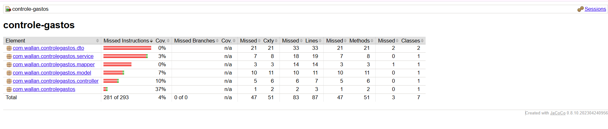

# 💸 Controle de Gastos - API REST


API REST em Java com Spring Boot para controle financeiro pessoal.  
Permite registrar, atualizar, listar, excluir e consultar transações financeiras, categorizadas por tipo, data, valor e descrição.

> 🔗 **Swagger:** [http://localhost:8080/swagger-ui/index.html](http://localhost:8080/swagger-ui/index.html)  
> 🐳 **Docker Hub:** [bobwallan/controle-gastos](https://hub.docker.com/r/bobwallan/controle-gastos)

---

## 📊 Visão Geral

- ☕ **Backend**: Java 17 + Spring Boot 3.5  
- 🧪 **Banco**: H2 em memória (ideal para testes)  
- 📖 **Documentação**: Swagger/OpenAPI 3  
- 📦 **Empacotamento**: Maven  
- 🚀 **Deploy**: Dockerizado

---

## 🧩 Funcionalidades da API

| Método | Rota                    | Ação                            |
|--------|-------------------------|---------------------------------|
| GET    | `/api/transacoes`       | Listar todas as transações      |
| POST   | `/api/transacoes`       | Criar nova transação            |
| GET    | `/api/transacoes/{id}`  | Buscar transação por ID         |
| PUT    | `/api/transacoes/{id}`  | Atualizar uma transação         |
| DELETE | `/api/transacoes/{id}`  | Deletar uma transação           |

---

## 🔧 Tecnologias Usadas

- Spring Boot 3.5
- Spring Web
- Spring Data JPA
- Bean Validation
- H2 Database
- Springdoc OpenAPI / Swagger UI
- Maven Wrapper
- Docker

---

## 🧪 Cobertura de Testes



---

## ▶️ Como Rodar Localmente

### 🧰 Usando Maven
```bash
git clone https://github.com/WallanDavid/controle-gastos.git
cd controle-gastos
./mvnw spring-boot:run
